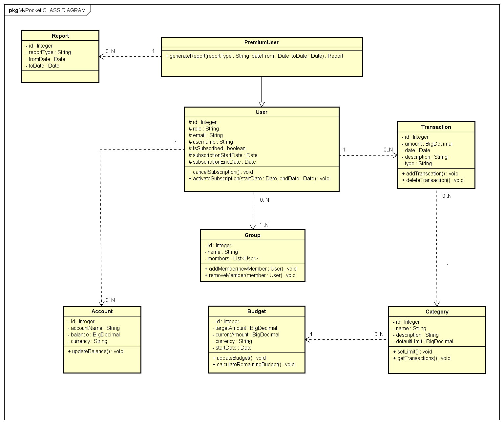

# MyPocket

## <i> Aplikace pro správu osobních financí </i>

###  Stepaniuk Vitalii, Havrikov Bohdan

#### Checkpoint 1 (Předmět EAR)

## UML CLASS DIAGRAM

## Software Requirements Specification

#### 2. CELKOVÝ POPIS APLIKACE

#### 2.1 PERSPEKTIVA PRODUKTU

Aplikace pro správu osobních financí je navržena tak, aby poskytovala uživatelům přehled o jejich
finanční situaci a usnadnila sledování příjmů a výdajů. Díky tomu mohou uživatelé lépe kontrolovat
své finance, analyzovat své výdajové návyky a plánovat své rozpočty. Cílem aplikace je pomoci
uživatelům lépe hospodařit s penězi, identifikovat zbytečné výdaje a zlepšit jejich finanční
rozhodování.

Aplikace je určena pro jednotlivce, kteří chtějí mít snadný a přístupný přehled o svých financích.
Uživatelé budou moci vytvářet a spravovat různé typy transakcí (příjmy i výdaje), přiřazovat je ke
konkrétním kategoriím (např. potraviny, doprava, zábava), a sledovat své výdaje v rámci
stanoveného rozpočtu. Aplikace bude k dispozici prostřednictvím uživatelsky přívětivého rozhraní,
které usnadní správu osobních financí.

Aplikace podporuje distribuovanou databázi, která uchovává informace o uživatelských účtech,
transakcích, rozpočtech a kategoriích. Aplikace je vyvíjena na klient/server architektuře, což
umožňuje bezpečnou a efektivní správu dat.

2.2 FUNKCE PRODUKTU

Hlavní funkce aplikace zahrnují:

- Registrace a autentizace uživatelů: Uživatelé se mohou registrovat, přihlásit a spravovat své
  účty. Prémioví uživatelé mohou vygenerovat reporty (popsané níž).
- Správa transakcí: Uživatelé mohou zadávat a spravovat své příjmy a výdaje. Každá transakce
  může být přiřazena konkrétní kategorii, což usnadňuje třídění a analýzu výdajů.
- Rozpočty pro kategorie: Uživatelé mohou vytvářet rozpočty pro jednotlivé kategorie výdajů.
  Aplikace umožňuje sledovat, jak se uživatelé přibližují ke svým limitům, což podporuje
  uvědomělé utrácení.
- Generování finančních reportů: Prémioví uživatelé mohou generovat reporty podle kategorií,
  období nebo konkrétních typů transakcí, což jim umožňuje podrobně analyzovat jejich
  finanční situaci.
- Podpora různých měn: Aplikace umožňuje spravovat finance v různých měnách, což je
  vhodné pro uživatele s mezinárodními financemi.
- Export dat: Možnost exportu finančních dat (např. ve formátu CSV) umožňuje uživatelům
  uchovávat a dále analyzovat své finanční informace mimo aplikaci.

2.3 CHARAKTERISTIKY UŽIVATELŮ A TŘÍDY

Aplikace bude podporovat následující typy uživatelů:

1. Standardní uživatelé (User) – Mají přístup k základním funkcím, jako je zadávání a správa
   transakcí, sledování rozpočtu.
2. Prémioví uživatelé (Premium user) – Kromě základních funkcí mají možnost generovat
   podrobné finanční reporty a exportovat data.

2.4 PROVOZNÍ PROSTŘEDÍ

Aplikace bude fungovat v následujícím provozním prostředí:

- Databáze: PostgreSQL pro ukládání a správu uživatelských dat a transakcí. Údaje budou
  uloženy v centralizované databázi s potenciálem na distribuované nasazení.
- Vývojová platforma: Java (Spring Boot).

2 .5 OMEZENÍ

- Aplikace nebude poskytovat přímé propojení s bankovními účty pro automatické načítání
  transakcí.
- Žádná podpora a analýza investic, akciových portfolií, kryptoměn nebo jiných finančních
  aktiv.
- Aplikace nebude obsahovat funkce pro správu daní a daňových odpočtů.
- Neumožňuje automatické aktualizace směnných kurzů v reálném čase.

2.6 PŘEDPOKLADY A ZÁVISLOSTI

Předpokládáme, že aplikace bude používána jednotlivci, kteří chtějí mít kontrolu nad svými osobními
financemi. Základní funkce jsou navrženy tak, aby byly přístupné širokému okruhu uživatelů.
Prémiové funkce jsou určené pro uživatele, kteří chtějí podrobnější analýzu svých financí.

Aplikace v budoucnu bude závislá na SQL databázi, která poskytuje úložiště pro transakční data a
podporuje komplexní dotazy pro generování finančních přehledů.

