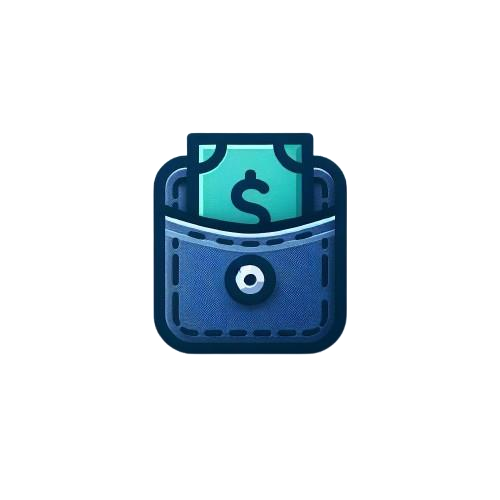

# MyPocket

## Tato aplikace slouží ke správě osobních financí a umožňuje uživatelům:
- Sledovat své příjmy a výdaje.
- Vytvářet účty s možností přidávat další uživatele.
- Spravovat rozpočet každého účtu.
- Používat podporované měny: CZK, EUR, a USD.
- Uživatelé mohou přidávat transakce a sledovat finanční výsledky.
## Funkce pro administrátora:
- Přístup ke všem CRUD operacím (vytvoření, čtení, úprava a mazání).
## Prémiový účet:
- Majitelé prémiových účtů si mohou generovat reporty za zvolené časové období.

## Databáze
Aplikace používá databázi H2, která je dostupná na adrese:
http://localhost:8080/h2-console po spuštění aplikace.

## Instalace a spuštění
### Postup:
- Otevřete projekt v nástroji IntelliJ IDEA.
- Spusťte aplikaci – server se automaticky spustí.

## Testovací data
### Přidání testovacích dat:
- Testovací data lze nahrát prostřednictvím konzole H2 databáze.
- Všechny potřebné SQL příkazy jsou k dispozici v souboru:
resources/db.txt

## Testování aplikace
### Scénáře v Postmanu:
Pro testování lze využít nástroj Postman.
Importujte soubor SCENARIES.json, který najdete v projektu.
Po importu spusťte připravené scénáře ve složce "Scenarios", abyste ověřili funkčnost aplikace

## Feedback:
#### Vitalii Stepaniuk: 
Největší problémy jsem měl s řešením závislostí v REST API a s nastavením HTTP požadavků v Postmanu. I přes tyto těžkosti byla práce na semestrálním projektu zajímavá a užitečná. Na cvičeních jsme dostali hotovou aplikaci, kterou jsme mohli použít jako příklad, a to mi hodně pomohlo. Díky tomuto projektu jsem lépe pochopil, jak funguje REST API, Spring Boot a jak používat Postman. Naučil jsem se také lépe organizovat kód a řešit problémy se závislostmi. Celkově to byla dobrá zkušenost, která mi pomohla zlepšit mé dovednosti v programování.

#### Bohdan Havrikov: 
Největším problémem v této semestrální práci pro mě bylo psaní testů. Na druhou stranu to ale bylo docela zábavné, protože jsem mohl testovat již hotový projekt a trochu si pohrát s daty. Měli jsme k dispozici hotový projekt e-shopu, který obsahoval příklady testů, což mi velmi pomohlo při jejich tvorbě. Díky tomuto projektu jsem lépe pochopil, jak se vytvářejí webové aplikace, a naučil jsem se pracovat se SpringBootem. Celkově se mi kurz velmi líbil a jsem rád, že mi pomohl zlepšit mé dovednosti v programování v Javě.

